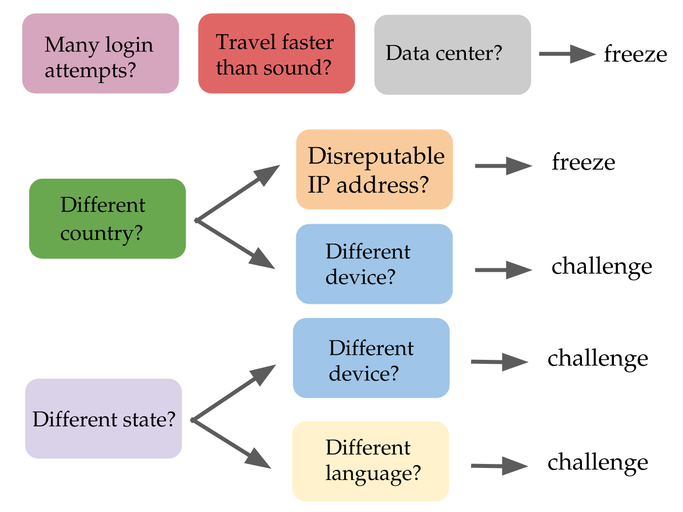

Remembering passwords, dealing with two-factor authentication,
answering security questions, having our credit cards frozen... in one
way or another, we've all become familiar with how cybersecurity
issues affect our daily lives. It is not an exaggeration to say that
our digital accounts are under constant attack. There have been the
well-publicized large security breaches, notably including the recent
Equifax breach (estimated 143 million social security numbers stolen),
the two large security breaches at Yahoo (totaling approximately 1.5
billion accounts compromised, potentially revealing passwords and
answers to security questions). On a much smaller scale, but perhaps
no less significant, the hacks of the Democratic National Committee
servers and of top Democratic officials' emails may have swayed the
2016 presidential election.

We cannot assume that our personal information is safe. Whether you
realize it or not, it is quite likely that your own sensitive
information -- including your passwords, social security number, and
credit card numbers -- has fallen into the wrong hands at some
point. And that's only considering the security breaches that we know
about! Just imagine how many smaller breaches are happening on a daily
basis that are never publicized, and perhaps are never discovered in
the first place.

The largest companies have dedicated security teams that do their best to
protect their networks and their users. But many other companies have
neither the expertise nor the resources to monitor their accounts.
Fortunately, a new cybersecurity startup aims to address this situation.


## Castle 

Castle is a startup that provides account security for
businesses that operate web or mobile apps. Castle monitors the users
of those apps, and looks for suspicious activity that may suggest that
a user's account may have been taken over. If they notice something
suspicious they send a recommendation to the customer that the user's
account should be frozen, or that the user should be challenged in
some way -- perhaps by asking a security question.

For my project I consulted with Castle to look into different ways to
approach the problem of identifying compromised accounts. A key
problem that we were interested in is, how can feedback data -- data
about whether or not a user account that had been flagged as
suspicious turned out to actually have been compromised or not -- be
used to make account security algorithms smarter over time.


## A first step in detecting account compromise

Broadly speaking, there are a number of challenges in detecting
account compromise. One is the needle-in-a-haystack effect: the number
of uncompromised accounts will generally be dramatically higher than
the number of compromised accounts, and users may interact with their
online accounts in a wide variety of perfectly legitimate ways. A
second difficulty has to do with the lack of feedback data. For young
companies the range of legitimate user behavioral patterns will not be
known, so this becomes an unsupervised classification problem. Over
time, of course, a company can build up feedback that can be used to
train a model -- Castle itself is a recent startup and is still very
much in the phase of learning about user behavior, and in gathering
sufficient feedback data.

What are the possible ways to detect compromised user accounts in an
unsupervised fashion? A straightforward, common-sense approach would
be to apply a set of rules and heuristics to whatever features of user
activity are being logged. For instance, if a user is suddenly logging
in using a new device, or is logging in from a new country, how should
you handle that situation? What if the user is logging in using a new
device *and* from a new country? For a completely unsupervised
approach, we can imagine making common-sense decisions to account for
each case. For instance:


<p align="center">
  
</p>
 </div>


This approach, while a good (and probably necessary) starting point,
has many limitations. These include:

 * Since this type of rule-based system would (at least initially) be
   set up by hand, it is difficult to imagine how to optimize it in an
   algorithmic way once feedback data become available.

 * It is not flexible -- related to the previous point, this type of
   system is not very flexible or generalizable. Castle, which has
   multiple customers with differing user bases -- for instance, some
   customers may have users spread throughout the world whereas others
   may be highly localized -- it's important to have a model that can
   be applied and optimized in a more general way.

 * It only works for categorical variables. Although most of the types
   of information that Castle deals with are categorical (e.g. type of
   device used), in principle there may be continuous features that
   can also be taken into account(e.g. the geographical distance
   between login events).

 * Prior information -- in some cases larger patterns may appear, for
   instance that many accounts are being attacked from a certain
   geographical location, or that a particular user is likely to log
   in from widely varying locations. We would like to take this
   information into account, but it isn't obvious how to do this in a
   rule-based system.

 * Ideally we could assign reliable probability estimates of account
   compromise after ever user action, but this system only provides a
   categorical recommendation.


## A simple, flexible model

As a first step toward taking a more flexible approach, we can
formulate a rule-based system as a linear model:

```
P = w_1*f_1 + w_2*f_2 + ...
```

where each *w_i* is a weight, and each *f_i* is a binary feature
(i.e. whether the user is logging in using a new device or not). The
parameter *P* can be interpreted as an attack score, and thresholds
can be set, e.g. an user account should be frozen if *P* is greater than
some value *X*, and should be challenged if *P* is greater than *Y* but less
than *X*. The features, weights, and threshold values can be chosen to
closely mimic, or even possibly to exactly reproduce, the rules-based
system described above.

This formulation has the significant advantage of being very flexible;
new features can be added at will, and the weight associated with each
feature can be optimized based on feedback data. The weights can be
further tuned for each of Castle's customers, and can easily and
quickly adjusted for individual users. Moreover, if the weights are
suitably chosen, the parameter P can even be interpreted as an
approximate probability of account compromise.

So how can the *w_i* parameters be optimized once feedback data are
available? The obvious answer is logistic regression. The parameter P
can be set to either 0 or 1 for legitimate user actions and actions by
compromised users, respectively.

At this point some readers may be thinking that this linear model
seems ad-hoc, which is true! But there is at least some mathematical
justification. To see this, imagine that that there are several
features that are associated with an increased probability that an
account has been taken over; let's refer to these probabilities as
*P_1*, *P_2*, etc. If these features are independent of each other,
i.e. there are no interaction terms, then the summed probability can be
written


```
P = 1-(1-P_1)*(1-P_2)*(1-P_3)*...
```

Expanding out this equation, and dropping all of the higher-order
terms (since we expect that each *P_i<<1*), we recover the linear model
shown earlier. But it remains true that the linear model is not
strictly speaking consistent with assumptions that go into a logistic
regression, even though that is what we used one to estimate the
weights. It would be more self-consistent to just use the logistic
equation to calculate *P*, however there may be other features that we'd
like to take into account that would still need to be added linearly
(for instance, a penalization for a login from a location near a Tor
node or from a country that is the source for many hacking
attacks). Of course, evaluating the effectiveness of different
approaches to calculating P, and for determining the weights, is going
to require significant (and complete!) feedback data.


## What other approaches are there?

Of course, we can approach the problem of detecting account compromise
using a more straightforward mathematical approach. Especially if
you'd like to do things like take into a account a user's history or
incorporate information drawn from a variety of sources, this starts
to look like a traditional problem for classical statistics and
Bayes' theorem. Such an approach is described here:
http://theory.stanford.edu/~dfreeman/papers/ato-model.pdf.  From my
own point of view, this more rigorous mathematical approach is
appealing and may well lead to better results -- but the large number
of (at times questionable) assumptions and approximations that need to
be made in order to put the equation into a useable form mean that
this approach may not actually be so rigorous. Fortunately, even this
approach can be written as a linear model (where the *f_i$ features
are the log probability; see equation 13 in the above paper).

And how else might we tackle the problem of detecting account
compromise? There is a large variety of anomaly-detection techniques
available. Many of these are density-based techniques (e.g. K nearest-
neighbor), however for the primarily categorical data considered here
the local density in N-dimensional space becomes less well-defined.
Moreover, when calculating local densities, how can we best combine
information from a particular user's own usage patterns with the
usage patterns of all users? The answer to this question wasn't clear
to me, so I didn't consider density-based techniques any further.

The figure at the top of this page brings to mind the
popular machine learning technique of random forests. However there
are several reasons that I decided not to pursue this approach. The
most fundamental is that, Castle may want to assign features and
weights both on a per-customer basis *and* on a per user basis. Random
forests don't provide a natural means of doing this, and even if there
were, we can't be continually training, and storing, and re-training a
large tree for millions of users individually. Additionally some of
those features may have many possible values -- for instance you can
have a feature for a user suddenly logging in from a new country, but
then sub-features for 190-some countries in the world. So it might
become a very wide and a very deep tree, very fast. Finally, we have a
very unbalanced dataset, with many more legitimate user actions than
illegitimate user actions, and this can be a significant problem while
training tree-based methods. And you'll start to wonder if a tree is
the natural method for Castle to pursue!.

### Conclusions

For all of these reasons I decided to stick with a linear model, with
weights that can be tuned using logistic regression. This model
provides ease of interpretation and implementation, allows us to tune
the weights on a per-customer and a per-user basis, and can be easily
optimized when training data are available. Of course, evaluating any
model -- including identifying the more important features and
tuning to find optimal performance -- can ultimately only be tested on feedback
data when they become available. 

I've described here some of the issues that I've been investigating
these last couple weeks of working with Castle, and why I chose to
proceed with the method that I did. I've really enjoyed this work,
and would like to thank Castle, and the CTO Sebastian Wallin in
particular, for the opportunity to be involved.
